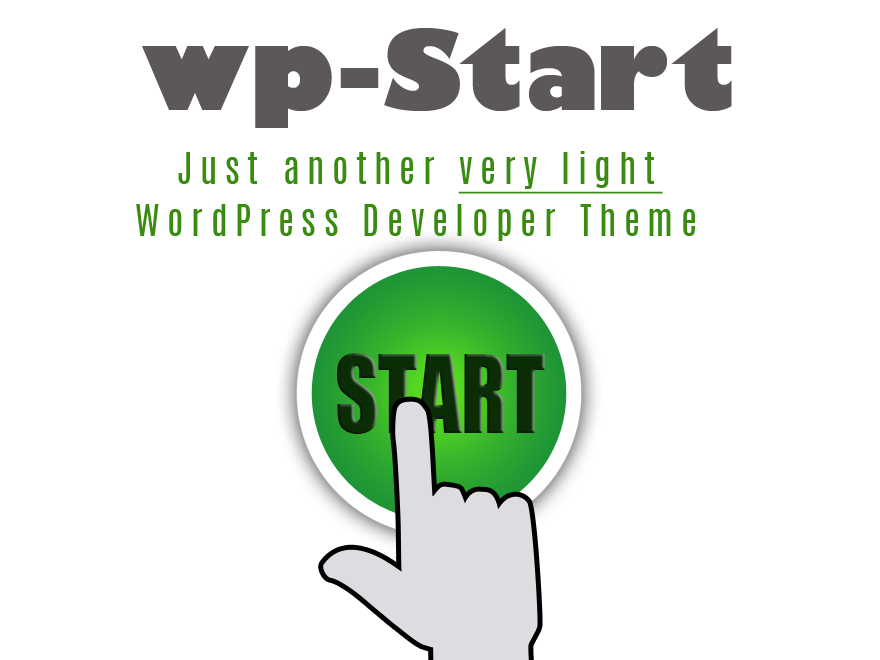

# Start - Starter Theme for WordPress

#### Version 1.0

___

Start is a <em>light, simple</em> developer theme for <em>WordPress</em>. The idea is to create a <em>website design</em> in <em>html</em> and when it's tested and approved turn it into a <em>WordPress</em> site using this very basic theme with all the <em>WordPress</em> elements.

<h5>Starting from scratch</h5>
The theme uses the <strong>[Phone1st](https://phone1st-theme.netlify.com/)</strong> basic styles and a few basic <em>WordPress</em> styles to view the theme if you want to build a theme from scratch.

## All set for using Scss
The starter theme was built using CodeKit. Codekit is only used for parsing the scss and scripts so the theme can be easily adapted to use any scss parser.

## Includes:

+ Head cleanup
+ the usual post meta and post thumbnails
+ navigation functions
+ related and poular posts
+ function for Google fonts
+ all common theme support functions expected in WordPress
+ sidebar and footer sidebar
+ three menus, main, social and footer
+ Basic customizer, includes custom header background
+ Ready to take languages
+ All functions easily editable
+ All templates easily editable
+ Basic stylesheet ready for changing
+ Editor stylesheet
+ login stylesheet
+ Scripts set to minify

### Contact Info:   
email [h@bylucas.co.uk](mailto:h@bylucas.co.uk)  
Download the theme [here](https://github.com/bylucas/wp-start)
 

